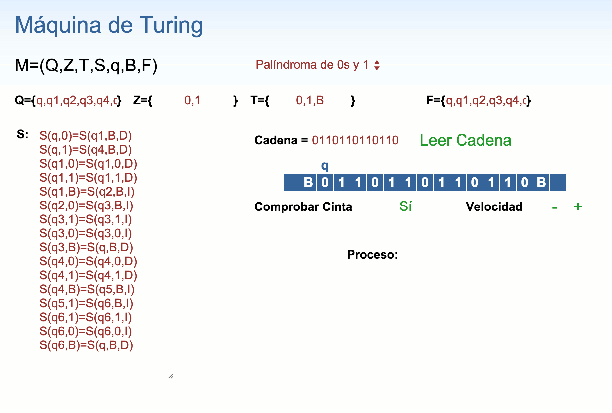

# Web-Turing-Machine
About JavaScript applied for the development of a Turing Machine

### Definition

- **M:** Machine 
- **Q:** Set of states 
- **Z:** Input symbols
- **T:** Tape machine alphabet
- **S:** Transition function
- **q:** Initial state
- **B:** Blank symbol
- **F:** Final machine states

### Usage

- Select one of the sample machines:
	- {abc}* strings	
	- 0s and 1s string palindromes
- or define your own machine **M(Q, Z, T, S, q, B, F)**
- Extra settings:
	- **check emptiness** of tape at the end
	- accelerate or diminish **speed**
- Run and enjoy!

### Preview

